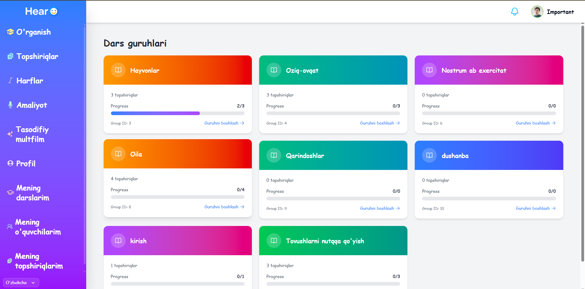

# 🎧 hearO — Inclusive Speech & Hearing Learning Platform

> 🇺🇿 **hearO** — eshitish qobiliyati cheklangan bolalarga so‘zlash va eshitishni o‘rgatishga mo‘ljallangan interaktiv ta’lim platformasi.  
> 🇬🇧 **hearO** — an inclusive learning app designed to help children with cochlear implants develop speech and hearing skills.  
> 🇷🇺 **hearO** — образовательная платформа, помогающая детям с кохлеарным имплантом развивать речь и слуховое восприятие.

---

## 📸 Preview


---

## 🧠 Project Overview

**hearO** — bu neyrochip (cochlear implant) o‘rnatilgan bolalarga mo‘ljallangan raqamli ta’lim tizimi bo‘lib, ular uchun:
- tovushlarni farqlash,
- talaffuzni to‘g‘rilash,
- va so‘z boyligini oshirishga yordam beradi.

Loyiha foydalanuvchilar (bolalar), o‘qituvchilar va administratorlar uchun alohida interfeyslarga ega:
| Rol | Bo‘limlar | Tavsif |
|------|------------|--------|
| 👩‍🎓 Foydalanuvchi | `home`, `lessons`, `practice`, `profile`, `letters` | Mashqlar, darslar, ovozli testlar |
| 👨‍🏫 O‘qituvchi | `teacher`, `assignments` | O‘quvchilar uchun mashqlarni yaratish va kuzatish |
| 🧑‍💻 Admin | `admin` | Foydalanuvchilar va kontentni boshqarish paneli |

---

## ⚙️ Tech Stack

| Texnologiya | Maqsad |
|--------------|--------|
| [Vue 3](https://vuejs.org/) | Frontend framework |
| [TypeScript](https://www.typescriptlang.org/) | Statik tiplash |
| [Vite](https://vitejs.dev/) | Tez build tizimi |
| [Pinia](https://pinia.vuejs.org/) | State management |
| [Tailwind CSS](https://tailwindcss.com/) | UI dizayn |
| [Vue Router](https://router.vuejs.org/) | Navigatsiya |
| [VeeValidate + Yup](https://vee-validate.logaretm.com/) | Form validatsiyasi |
| [Axios](https://axios-http.com/) | API so‘rovlar |
| [vue-i18n](https://vue-i18n.intlify.dev/) | Ko‘p tillilik (UZ/EN/RU) |
| [Radix Vue](https://radix-vue.com/) / [Lucide Icons](https://lucide.dev/) | UI komponentlar va ikonlar |
| [Sonner](https://sonner.emilkowal.ski/) | Bildirishnomalar |
| [Husky + Lint-staged + Prettier](https://prettier.io/) | Kod sifati va auto-formatlash |

---

## 🏗 Installation & Setup

### 1. Repozitoriyani klonlash
```bash
git clone https://github.com/qurbonpulotrustamqulov/hearO.git
cd hearo
```

### 2. Kutubxonalarni o‘rnatish
```bash
npm install
```

### 3. Muhit o‘zgaruvchilarini sozlash  
`.env` yoki `.env.development` faylida quyidagilarni qo‘shing:

```env
VITE_API_URL=https://api.hearo.uz/api/
```

### 4. Lokal serverni ishga tushirish
```bash
npm run dev
```
Loyiha odatda shu manzilda ochiladi:  
👉 [http://localhost:5173](http://localhost:5173)

### 5. Build versiyasini yaratish
```bash
npm run build
```

---

## 🧩 Loyiha strukturasi

```
src/
 ├── assets/              # Statik fayllar (rasmlar, audio, video)
 ├── components/          # Qayta ishlatiladigan UI komponentlar
 ├── layouts/             # Sahifa layoutlari (admin, dashboard)
 ├── lib/                 # Yordamchi fayllar (toast, auth, utils)
 ├── pages/               # Asosiy sahifalar (home, lessons, practice, va h.k.)
 ├── router/              # Vue Router sozlamalari
 ├── service/             # API xizmatlari
 ├── store/               # Pinia holat boshqaruvi
 ├── App.vue              # Root komponent
 ├── main.ts              # Kirish nuqtasi
 └── vite-env.d.ts        # TypeScript uchun Vite tip fayli
```

---

## 🌍 I18n (Ko‘p tillilik)

Ilova 3 tilda ishlaydi:
- 🇺🇿 **O‘zbekcha**
- 🇬🇧 **Inglizcha**
- 🇷🇺 **Ruscha**

> 💡 Fikr: agar keyinroq boshqa tillar qo‘shilsa (masalan, qozoq yoki turk tili), `vue-i18n` fayllarini `src/locales/` ichida kengaytirish mumkin.

---

## 📡 API Integratsiyasi

Barcha ma’lumotlar `VITE_API_URL` orqali backend bilan almashiladi.  
Backend REST API formatda ishlaydi (JSON request/response).  
Axios interceptorlari `src/service/` ichida sozlangan.

---

## 🧪 Scripts

| Buyruq | Maqsad |
|--------|--------|
| `npm run dev` | Lokal dev serverni ishga tushirish |
| `npm run build` | Production build yaratish |
| `npm run preview` | Build natijasini ko‘rish |
| `npm run format` | Prettier bilan kodni formatlash |
| `npm run prepare` | Husky pre-commit hook tayyorlash |

---

## 🧰 Development Tools

- ESLint — kod sifatini tekshiradi  
- Prettier — avtomatik formatlash  
- Husky + lint-staged — commitdan oldingi tekshiruvlar  
- TypeScript — qat’iy tiplash va xavfsizlik  

---

## 🪪 License
```
MIT © 2025 hearO Project Team
```
---

## ⭐ Fikr va Hissa
Agar siz loyiha g‘oyasini yoqtirsangiz — **⭐ yulduzcha bosing** yoki **PR (pull request)** yuboring!  
> contact@hearo.uz  
> [hearo.uz](https://hearo.uz)

---
## Technical specification
**Uz**


**En**

---

